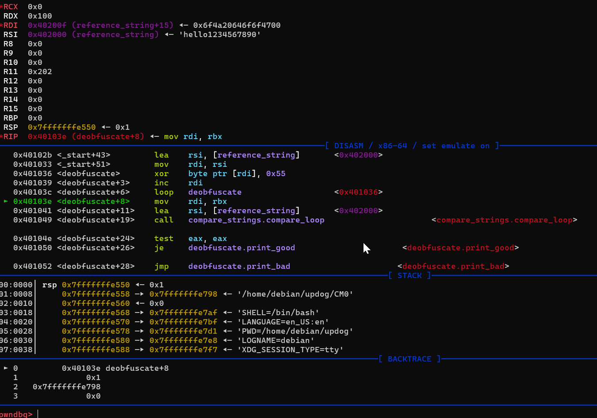
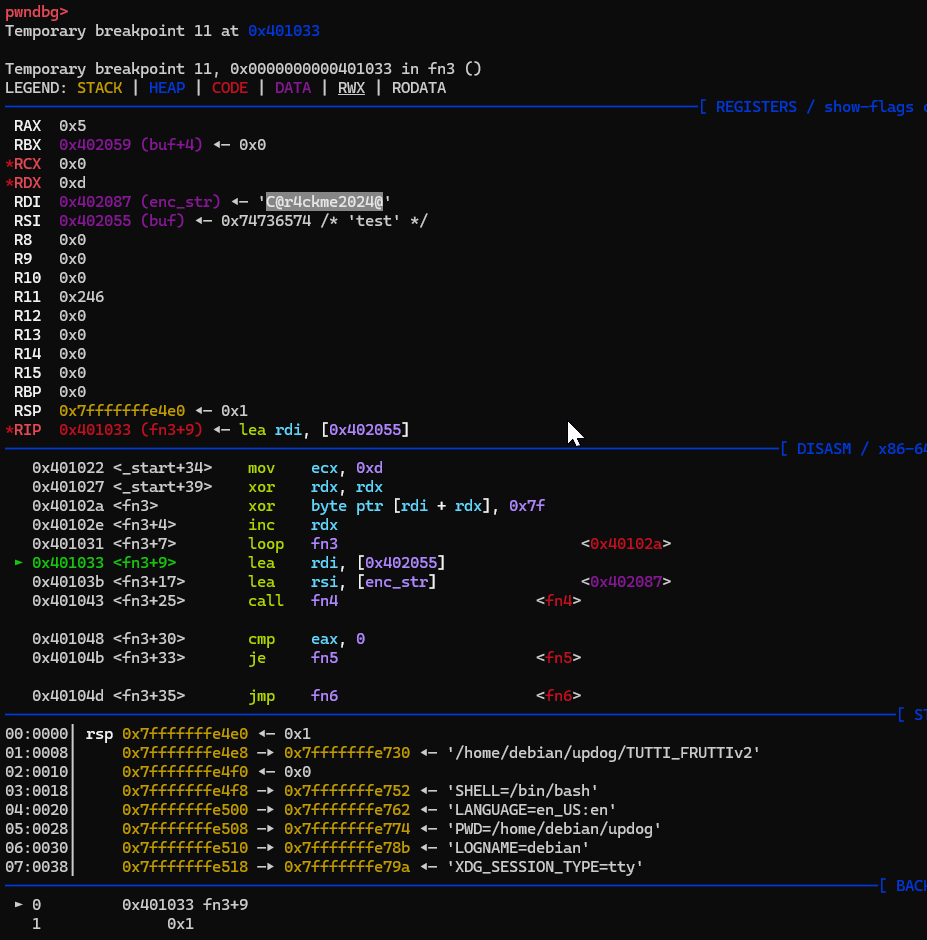
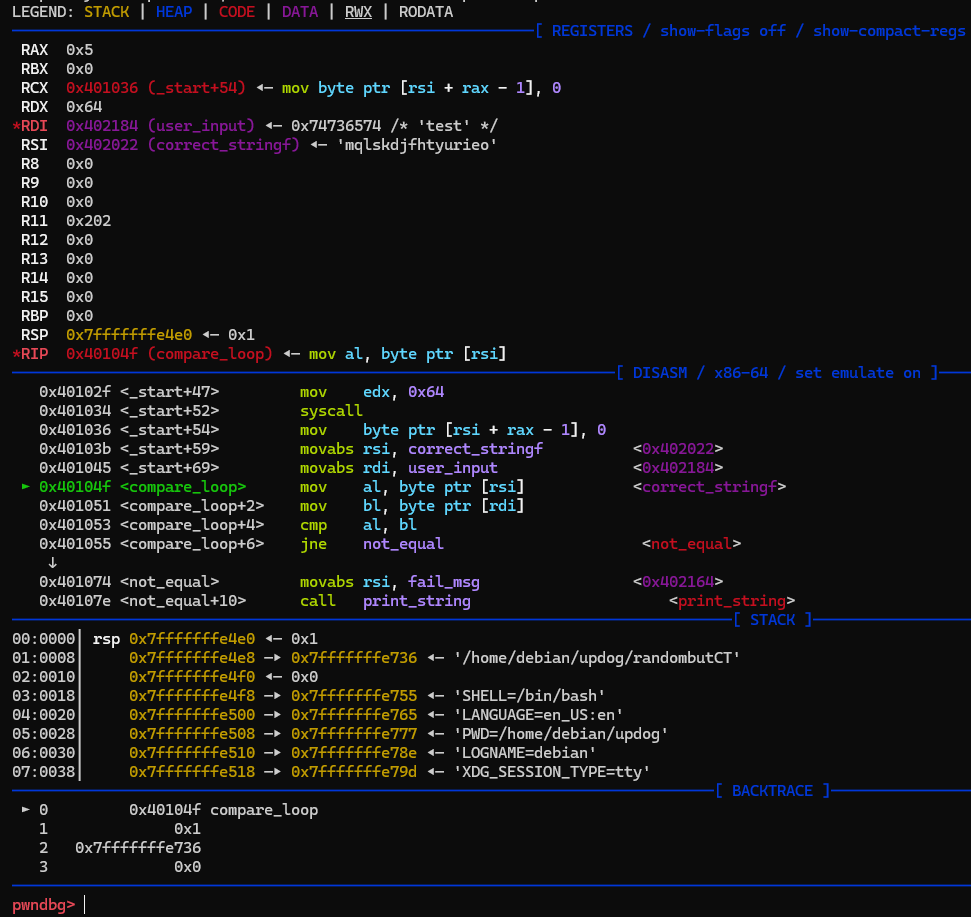
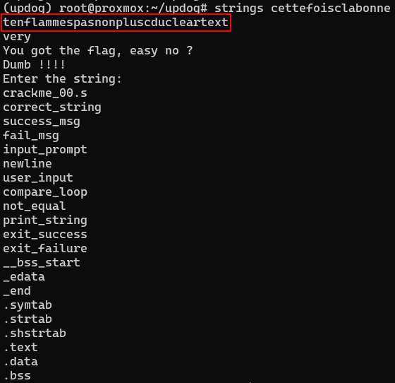
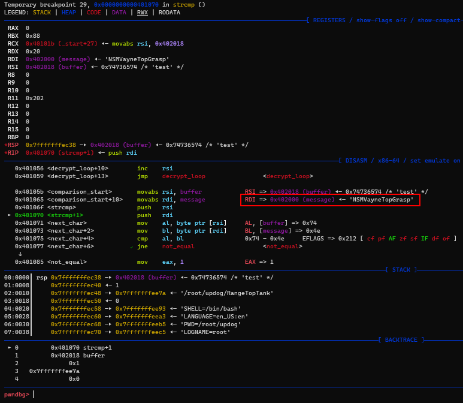

# WriteUp - CM0

Lorsque nous avons téléchargé le binaire, nous avons fait en sorte de commencer par une analyse dynamique avec PwnDBG.

Pendant l'exécution, nous avons constaté que dans les registres nous pouvons voir le mot de passe stocké dans RSI qui a pour valeur : "hello1234567890"

# WriteUp - TUTTI_FRUTTIv2 

Lorsque nous avons téléchargé le binaire, nous avons fait en sorte de commencer par une analyse dynamique avec PwnDBG.

Pendant l'exécution, nous avons constaté que dans les registres nous pouvons voir le mot de passe stocké dans RSI qui a pour valeur : "C@r4ckme2024@"

# WriteUp - randombutCT

Lorsque nous avons téléchargé le binaire, nous avons fait en sorte de commencer par une analyse dynamique avec PwnDBG.

Pendant l'exécution, nous avons constaté que dans les registres nous pouvons voir le mot de passe stocké dans RSI qui a pour valeur : "mqlskdjfhtyurieo"

# WriteUp - cettefoisclabonne

Lorsque nous avons téléchargé le binaire, nous avons effectué une analyse avec l'outil `strings` nous permettant de voir les chaînes de caractère en ascii dans le fichier.

Pendant l'exécution, nous avons constaté que dans le fichier nous pouvons voir le mot de passe stocké qui a pour valeur : "tenflammespasnonpluscducleartext".

# WriteUp - RangeTopTank

Lorsque nous avons téléchargé le binaire, nous avons fait en sorte de commencer par une analyse dynamique avec PwnDBG.

Pendant l'exécution, nous avons constaté que dans les registres nous pouvons voir le mot de passe stocké dans RSI qui a pour valeur : "NSMVayneTopGrasp"

